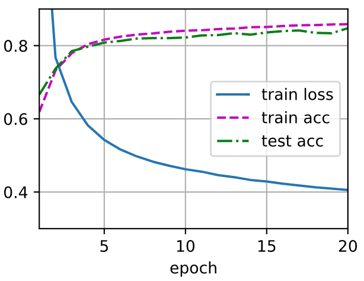
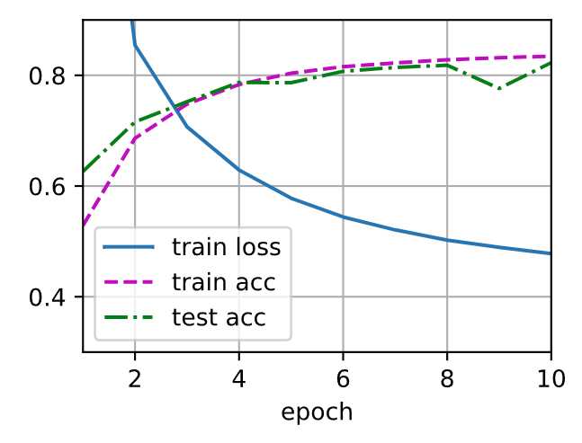
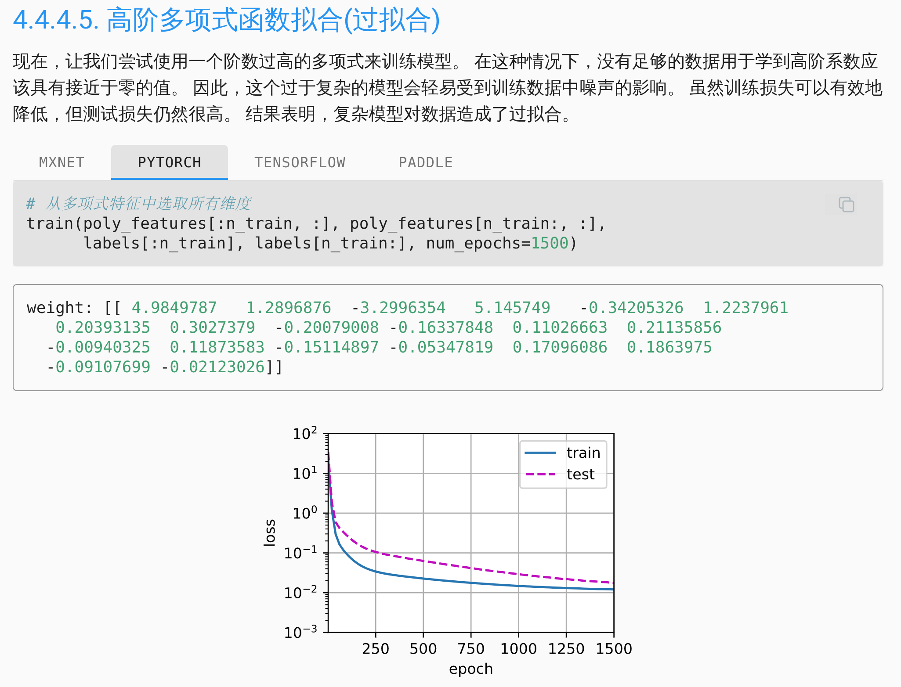
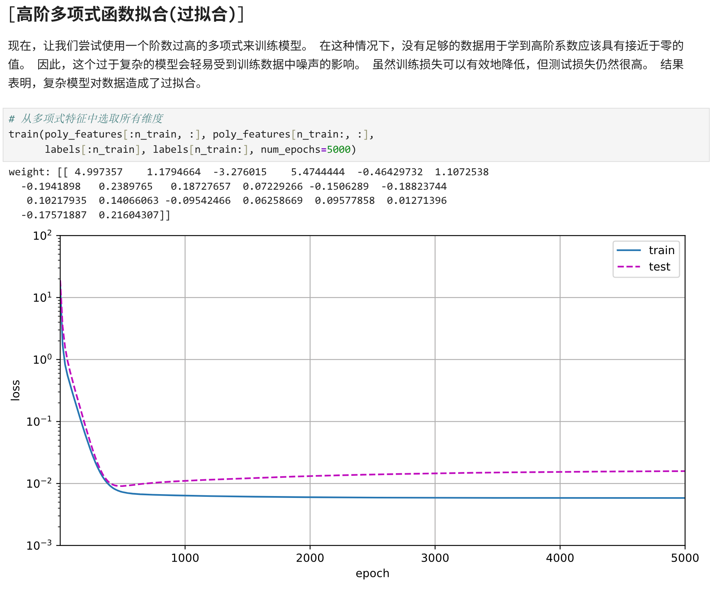

## 学习环境启动备忘
记得挂载磁盘`WORK`
```shell
cd /run/media/rmqg/WORK/learnDeepLearning/d2l-zh/d2l-zh/pytorch/
conda activate d2l
jupyter lab
```

## 2.预备知识、3.线性神经网络
教程先从`线性回归`和`softmax`回归出发，介绍了训练模型的基础方法，包括如下基础概念：

- `训练集（train set）`：用于让模型学习的数据
- `测试集（test set）`：用于检验模型泛化能力的数据
- `特征（feature）`：输入给模型的信息，如像素值、数值属性等
- `标签（label）`：样本对应的真实答案
- `样本（sample）`：数据集中的单个数据实例
- `模型（model）`：从输入映射到输出的函数或计算过程
- `参数（parameter）`：模型中需要通过训练学习得到的量，如权重和偏置
- `批量大小（batch size）`：每次送入模型训练的样本数
- `迭代周期（epoch）`：完整遍历一遍训练集的过程
- `前向传播（forward propagation）`：输入数据经过模型得到预测结果的过程
- `损失函数（loss function）`：衡量模型预测结果与真实标签之间差距的函数
- `准确率（accuracy）`：分类任务中预测正确样本所占的比例
- `梯度（gradient）`：损失函数对参数变化的敏感程度
- `反向传播（backpropagation）`：根据损失计算各参数梯度的过程
- `优化器（optimizer）`：根据梯度更新模型参数的方法
- `梯度下降（gradient descent）`：最常见的参数更新思想，沿着损失减小的方向调整参数
- `学习率（learning rate）`：控制每次参数更新步长的超参数
- `泛化能力（generalization）`：模型在未见过数据上的表现能力

并结合实际代码给出了训练模型的基本方法：

- 遍历整个训练集
- 前向传播
- 计算损失
- 反向传播
- 更新参数
- 统计这一轮的训练损失和训练准确率

### “简洁实现”与“从零开始实现”的区别

与前一节从零开始实现 softmax 回归相比，这一节的“简洁实现”在模型本质上并没有变化，仍然是对输入图像进行展平后，通过一个全连接层输出 10 个类别的分数，再配合交叉熵损失完成训练。两者的主要区别在于实现方式不同： 

从零开始实现时，需要手动定义模型参数 `W` 和 `b`，自己编写 `softmax` 函数、交叉熵损失函数，以及参数更新过程。这样做的好处是能够更清楚地理解 softmax 回归背后的数学原理和训练流程，例如前向传播、损失计算、反向传播和梯度下降分别在做什么

而在简洁实现中，这些底层细节大多交给了 PyTorch 的高级 API 来完成。例如，使用 `nn.Flatten()` 自动将输入图像展平，使用 `nn.Linear(784, 10)` 自动定义线性层及其参数，使用 `nn.CrossEntropyLoss()` 直接计算多分类任务的损失，再通过 `torch.optim.SGD` 完成参数更新。这样写代码更短、更规范，也更符合实际工程中的常见写法

此外，简洁实现相比手写版还有一个重要优点，就是数值稳定性更好。在从零开始实现时，如果直接按数学定义计算 softmax 和交叉熵，可能会遇到指数上溢、下溢以等问题；而框架内部通常已经对这些情况做了优化处理，因此在实践中更加安全可靠

> [!NOTE]
> 简介实现中隐去了`d2l.train_ch3`及其调用的函数的实现细节，推测应当和从零开始实现中的同名函数一致 

> [!WARNING]
> 3.7.6练习疑似存在如下问题：增加迭代周期数量，测试精度并不会再一段时间后降低，而会保持在一个上限附近


推测原因为`softmax`回归本质上是一个线性模型，其表达能力存在固有上限。模型仅有约`7850`个参数（784×10 + 10），面对`60000`条训练样本，参数量远不足以"记住"训练数据，因此无论训练多少轮，模型都无法真正过拟合——它陷入的是`欠拟合`而非`过拟合`。训练精度和测试精度最终都会收敛并稳定在某一上限附近（约85%），二者差距始终较小

过拟合现象的出现需要模型具备足够的容量来拟合训练集的噪声，而线性分类器在图像分类这类非线性任务上根本不具备这种能力。教材该练习的预设（"测试精度会在一段时间后降低"）更适合描述参数更多、表达能力更强的模型，例如多层感知机或卷积神经网络在小数据集上的行为

## 4.多层感知机
### 基本概念
- `深度神经网络（DNN）`：有很多隐藏层的神经网络
- `反单调性`：造成了线性模型拟合的限制性
- `设计非线性模型的出发点`：我们表示数据的时候会考虑到特征之间的相关交互作用，在此表示的基础上建立一个线性模型可能会是合适的
- `隐藏层`：在网络中加入一个或多个隐藏层来克服线性模型的限制， 使其能处理更普遍的函数关系类型
- `多层感知机（multilayer perceptron、MLP）`：将许多全连接层堆叠在一起。 每一层都输出到上面的层，直到生成最后的输出。把前L-1层看作表示，最后一层看作线性预测器
- `非线性的激活函数（activation function）`：对仿射变换后的每个隐藏单元应用，防止`多层感知机`退化为`线性模型`
- `通用近似定理`：理论上一个`单隐层网络`能学习任何函数，但通过使用`更深`（而不是`更广`）的网络，我们可以更容易地逼近许多函数
- `激活函数（activation function）`：通过计算加权和并加上偏置来确定神经元是否应该被激活，它们将输入信号转换为输出的可微运算
  - `ReLU函数`：$\text{ReLU}(x) = \max(x,\, 0)$
  - `sigmoid函数（挤压函数（squashing function））`：$\sigma(x) = \dfrac{1}{1 + e^{-x}}$
  - `tanh（双曲正切）函数`：$\tanh(x) = \dfrac{e^x - e^{-x}}{e^x + e^{-x}}$
- `过拟合（overfitting）`：模型在训练数据上拟合的比在潜在分布中更接近的现象
- `正则化（regularization）`：用于对抗过拟合的技术
- `训练误差（training error）`：模型在训练数据集上计算得到的误差
- `泛化误差（generalization error）`：模型应用在同样从原始样本的分布中抽取的无限多数据样本时，模型误差的期望
- `独立同分布假设（i.i.d. assumption）`：假设`训练数据`和`测试数据`都是从相同的分布中独立提取的。但实际上几乎所有现实的应用都至少涉及到一些违背独立同分布假设的情况

> 几个倾向于影响模型泛化的因素
> 可调整参数的数量。当可调整参数的数量（有时称为自由度）很大时，模型往往更容易过拟合。
> 参数采用的值。当权重的取值范围较大时，模型可能更容易过拟合。
> 训练样本的数量。即使模型很简单，也很容易过拟合只包含一两个样本的数据集。而过拟合一个有数百万个样本的数据集则需要一个极其灵活的模型。

- `模型选择`：在评估几个候选模型后选择最终的模型，如：
  - 本质上完全不一样的模型，如决策树与线性模型
  - 不同的超参数设置下的同一类模型，可能使用到`验证集`
- `验证集`：原则上，在我们确定所有的`超参数`之前，我们不希望用到`测试集`，以避免过拟合`测试数据`；也不能仅仅依靠`训练数据`来选择模型，因为我们无法估计`训练数据`的`泛化误差`。因此常见做法是将我们的数据分成三份， 除了`训练和测试数据集`之外，还增加一个`验证数据集（validation dataset）`，也称为`验证集（validation set）`
- `K折交叉验证`：原始训练数据被分成$K$个不重叠的子集。然后执行$K$次模型训练和验证，每次在$K-1$个子集上进行训练， 并在剩余的一个子集（在该轮中没有用于训练的子集）上进行验证。 最后，通过对$K$次实验的结果取平均来估计训练和验证误差

#### 过拟合与欠拟合
- `欠拟合（underfitting）`：我们的`训练`和`验证`误差之间的泛化误差很小，但都很严重，有理由相信可以用一个更复杂的模型`降低训练误差`
- `过拟合（overfitting）`：`训练误差`明显低于`验证误差`

是否过拟合或欠拟合可能取决于模型复杂性和可用训练数据集的大小

`模型复杂性`：


`数据集大小`：训练数据集中的样本越少，我们就越有可能（且更严重地）过拟合。给出更多的数据，我们可能会尝试拟合一个更复杂的模型（催生出了`深度学习`）


### 难点
对

- 学习率
- 训练轮数
- 隐藏层数
- 每层隐藏单元数

等`超参数`联合优化得出最优、较优解，且超参数之间并非彼此独立，而是相互影响，`超参数优化`是一个高位搜索问题，若暴力训练，代价很高

策略：

- `分阶段搜索`：
  - 先固定一个较简单的模型结构，调整好`batch size`
  - 搜索`学习率`
  - 再在较好的学习率附近，搜索`隐藏单元数`
  - 再比较`隐藏层数`
  - 最后再微调`训练轮数`
- `粗到细搜索`：
  - 先用较稀疏的候选值做粗搜索
  - 找到大致较优区域，再在附近做细搜索
- `随机搜索`：碰运气
- `早停`：看到结果太离谱早点停下来换超参数
- 先看验证集，不直接使用测试集，避免测试集也`过拟合`（d2l在这里还只有训练集和测试集，故暂时不需要关注）

作者在做`4.3 多层感知机的简洁实现练习`时，选用`batch size`256，`lr`0.03，`隐藏单元数`1024，`隐藏层数`1，`训练轮数`20的超参数，取得训练结果如下：



## 碎碎念
为什么`test acc`曲线随机在这个地方有一个莫名其妙的下凹啊



> [!CAUTION]
> 要成为一名优秀的机器学习科学家需要具备批判性思考能力

为什么教材跑出来的过拟合和我跑出来的不太一样🤔





