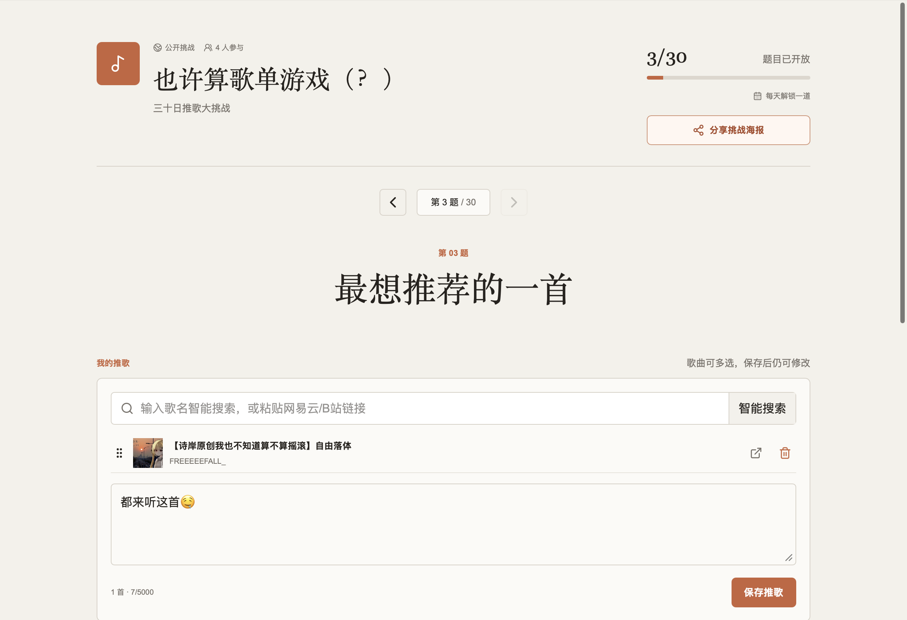

前几天在群里看到一张“三十日推歌大挑战”的问卷，忽然觉得这种玩法不应该只停留在一张图片上：如果每个人都能真正选择歌曲、听别人推荐、点赞评论，再把结果留存下来，它会更像一个持续发生的小型音乐交换会。

于是有了 **推歌挑战**。





## 不是固定的三十题问卷

最初那张图只是一份示例，不是所谓的“经典题库”，更不是网站的默认内容。新挑战的题库默认留空，发起者可以自己写任意数量的问题，也可以载入三十题示例，或者直接上传一张已有问卷图片，让视觉模型识别成可编辑的题目列表。

题目可以一次性全部开放，也可以每天开放一道。逐日开放统一按照北京时间计算，首页只展示当前已经开放、但自己还没有回答的挑战；已经答完的内容不会继续占着待办区域。

## 用歌回答，也围绕歌交流

每道题可以选择一首或多首歌曲，并补充一段感想。当前支持哔哩哔哩视频和网易云单曲链接，其他参与者可以直接播放来源页面、点赞和评论。

网站还保留了原问卷里很有意思的“印象曲”玩法：给群友一个关键词，对方再为这个词选择一首歌。相关互动会通过站内通知送达，并准确跳转到对应题目和答案。

公开挑战可以在广场被发现；Token 挑战则使用六位数字邀请凭据。分享海报会列出最多三列、三十道题，并带有二维码；Token 挑战的二维码可以直接携带邀请信息。

## “智能搜索”如何寻找本家

只输入歌名时，服务端会读取 B 站前三页、最多五十项真实搜索结果，再把标题、投稿者、简介和发布日期等证据交给模型筛选。模型不会输出容易抄错的 BV 号，只返回候选序号，真实链接由服务端回填。

筛选结果包含原创本家、翻唱、官方重制、二创等结构化分类。播放量可以作为弱辅助证据，但不会压过标题、来源与发布时间。成功结果会按归一化歌名永久缓存，同一首歌之后不再重复花费模型 token。

## 实现与运维

项目使用 Next.js 16、React 19、Better Auth、Drizzle ORM 和 PostgreSQL 17，部署在 Docker Compose 中。图片题库经 OpenRouter 视觉模型转录，歌名筛选使用 DeepSeek；平台逻辑都隔离在适配器之后。

生产环境包含健康检查、数据库备份、平台 Cookie 登录态监控和 Bark 掉线提醒。敏感配置只放在服务器 secret 中，不进入前端、日志或 Git 仓库。

项目以 **GPL-3.0-only** 开源。现在的界面和规则当然还会继续变化，但至少下一次群里再出现一张推歌问卷时，我们可以真正一起玩起来了。

## 开源发布补记

**GitHub：** [rmqg/playlist-challenge](https://github.com/rmqg/playlist-challenge)

`playlist-challenge` 现已作为完整的公开仓库发布在 [GitHub](https://github.com/rmqg/playlist-challenge)。主页先写给想和朋友一起推歌的人：怎么出题、怎么答、怎样交换感受；后半部分也保留了自托管、部署与贡献入口。

仓库补齐了 GPL 版权与第三方通知、脱敏的部署样板、贡献与安全政策，以及自动运行类型检查、静态检查、测试和生产构建的 CI。平台 Cookie、模型密钥、Bark 配置和运行数据都不会进入公开仓库。

图片题库在境外生产服务器仍默认使用 OpenRouter：实际访问硅基流动服务的效果不佳。对于在中国大陆部署、并愿意自行从目标服务器验证延迟与稳定性的开发者，仓库另附了[硅基流动 SDK 配置参考](https://github.com/rmqg/playlist-challenge/blob/main/docs/SILICONFLOW.md)。
