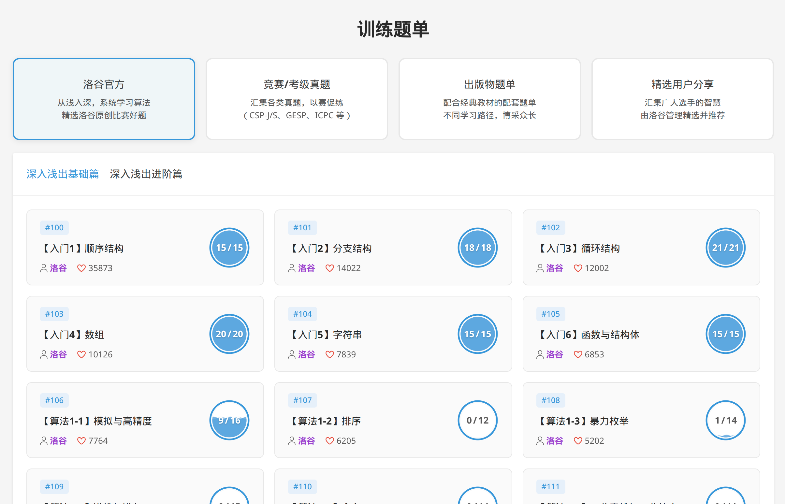
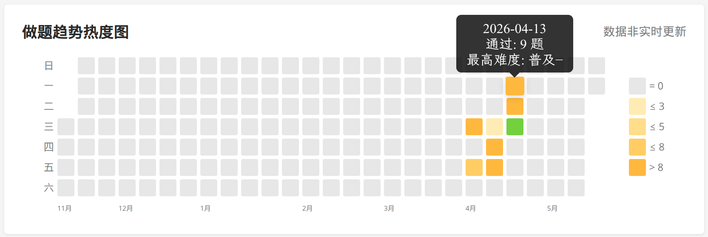

## 入学以前

入学前我大概对想学什么、将来想做什么尚且没有任何的规划吧。听他们说东校电子信息的师资比珠微要好，于是想一出是一出打算去到东校的电子信息学院，当时甚至不知道应该如何过去。

---

## 大一上

也是延续高中的学习状态吧，亦或者可以说是被长辈、高中老师洗脑了。我大一的时候应该说是非常卷的（至少是期末考试前的一两个月吧），大一上混混噩噩的过完了半年，应该说尝试过做一些事吧，但都因为自己的怠惰无疾而终了，比如**一生一芯**、尝试过的吉他等。

总的来说，大一上的上半学期，除了作业之外，我大抵看了几部番，学了一点**一生一芯**（实际上`Linux`、`CS`入门等方面的收获甚至比一生一芯本身的主线更大）、尝试做了第一个`Blog`。下半学期似乎突然发现再不好好复习期末可能挂科，于是非常认真的复习了一个多月的**高数**、**大物**与**线代**。

应该说最后的成绩挺不错的吧，碰巧拿到了珠微的`rk1`，这也为我转专业、申请奖学金的顺利积累了一定的优势。

---

## 大一下

大一下只能说比大一上更为颓废吧，疑似除了看了点番之外可以说道的事大概首先是花了几百买了一台二手的服务器组`NAS`，大概花了不少时间在配置文件系统、组内网以及进行内网穿透这方面。以及重新搭建了`Blog Ver.2`（第一版的`VPS`好像出了点问题，我不知道为什么没有选择尝试迁移`Blog`而是从零开始搭建了一个，又花费不少时间）。

但做这些真的有意义吗？很多花了很多时间搞出来的东西一旦失去维护，短时间内就毁弃了，而一直维护一些东西也是一件很累的事。

然后从大概五月开始有过一段恋爱经历，对方是社团的一个女孩子，最初是在社团活动认识的，在`QQ`上聊天比较多，**5.12**的凌晨，我表白，她同意了。大概是两个人都很不成熟且各种观念的差距很大，除了最开始的一小段时间，相处得都很不融洽。后来在2026年的情人节分手了。

---

## 第一次转专业

这次转专业的准备过程其实很短暂，收到教务系统的转专业文件的时候，目标就基本选定在电信与计院了。可能因为我当时是恋爱脑~~（虽然都是现在也并非不是恋爱脑）~~想优先保证能和女友去相同的校区（东校）吧，选择了更保险的电信院。

整个准备过程算是非常的轻松的，鉴于足够高的绩点，只是考前准备了一些英文自我介绍，就成功的进入了电信院。

附带部分和`CandleST`的聊天记录：
```text
2025/05/05 17:44
若木秋光：话说转专业的面试应该不需要怎么准备desuka
[图片]
CandleST：不清楚
CandleST：但是会电子+高绩点稳稳的过
若木秋光：好的喵～
若木秋光：🌿

2025/05/10 09:41
若木秋光：不对啊，今年cs转专业初试只有77人
若木秋光：录取好像是60人
若木秋光：你去考的话稳进的啊
[图片]
若木秋光：喵？
[图片]
若木秋光：比例都奔80%去了
若木秋光：比电信院还高
CandleST：没这个欲望（）
CandleST：我已经决定在冲深待着了

2025/05/10 12:57
[图片]

2025/05/22 08:06
若木秋光：[图片]
若木秋光：佬！
若木秋光：还是想不明白我为啥要转去电信院而不是计院()
若木秋光：想code😭

2025/05/22 12:09
若木秋光：就纯粹水进去的
若木秋光：仰慕一切认真复习过的人
若木秋光：感觉好久没有认真学习过了
若木秋光：堕落了喵～

2025/05/22 12:16
CandleST：[不支持的元素类型]我是氵进网安的
CandleST：[不支持的元素类型]并非氵
若木秋光：好好好
CandleST：绩点4.19
CandleST：稳进的
若木秋光：[不支持的元素类型]并非不水
若木秋光：考前晚上才看自我介绍
若木秋光：考的电路和C属于差点直接把答案告诉我了
CandleST：[不支持的元素类型]无敌了
CandleST：太想要你了
若木秋光：对的
CandleST：/崇拜/崇拜
```

---

## 大二上

然后是懵懵懂懂的进入了大二的学习。鬼使神差的选上了电信院大二上的所有专选课，还报了计院的辅修（总共2学分的实验课，72学时），同时还参加了大量的运动社团，还花费了很多时间和对象约会之类。

最终的结果是：**成绩不出所料的炸了，炸得很彻底。**

首先是一大堆没写完的作业，甚至`复变函数与数理方法`的作业直到我考试结束还欠了不少。

其次是非常不完备的复习，期末的复习时间被极限的压缩、有的课甚至考试的时候还有很多基础概念没背熟，更别论较熟练的计算了。

唯一幸运的事可能是加入了`MSC`吧，获得了接触你鸭最聪明的`CS`人才、最前沿的`CS`知识的机会。

可能是对电信院的培养方式和氛围非常的失望吧，也可能是觉得自己很不适合`EE`方向的学习吧，又或许是单纯的想逃避自己注定破裂的成绩吧，期末考试之前便慢慢地对转专业有了模糊的意向。

我开始向当时唯一认识的转专业到`CS`方向的`CandleST`询问，祂给了我一点信息，一点勇气，以及一个群聊：一个汇聚了中山大学所有想转向`CS`方向的冒险者的群聊。

**2025年12月13日**，我和`CandleST`讨论了部分关于转专业的事，并应邀加入了`2026计算机学院转专业交流群（QQ群号：476972628）`
```text
2025/05/11 15:38
若木秋光：话说有点想降转计院了
若木秋光：电信太卷了
若木秋光：也不太感兴趣（
CandleST：其实计也卷（？）
CandleST：[不支持的元素类型]可以的
若木秋光：🌿
CandleST：但是要降一年？
若木秋光：就是担心保研和就业问题
若木秋光：哎
若木秋光：[不支持的元素类型]对
若木秋光：还好吧说是
若木秋光：反正最近经济形势不太好，多在学校待几年问题不大说是
若木秋光：[不支持的元素类型]111111
若木秋光：大一和大二的考核是一样的吗？
CandleST：都可以的吧
CandleST：[不支持的元素类型]是的
若木秋光：考高数和程设的话应该问题不大？
若木秋光：程设肯定没问题
CandleST：[不支持的元素类型]是的
若木秋光：高数也不难
CandleST：你的水平随便转
若木秋光：至少比这学期的傻逼数学和物理简单多了
若木秋光：[不支持的元素类型]在电信院微电方向掉到保研线啦
若木秋光：😡
若木秋光：谁家3.7/4.0的保研绩点啊😡
若木秋光：要是大二上考砸了就转（虽然大概率的事（xx
CandleST：[不支持的元素类型]医学院（？）
CandleST：[不支持的元素类型]别担心的
CandleST：你可以id
CandleST：的
若木秋光：[不支持的元素类型]电信院(
[图片]
[图片]
CandleST：吓人

2025/05/13 08:22
若木秋光：差不多决定要转力
若木秋光：哎还得把高数捡起来
[图片]
若木秋光：话说要补修数分嘛
[图片]
[图片]
[图片]

2025/05/13 12:44
CandleST：[不支持的元素类型]可能要

2025/05/13 12:46
[图片]
[图片]
[图片]

2025/05/13 17:37
若木秋光：话说你不是有一个朋友转到计院了吗
若木秋光：能不能推一下😋
若木秋光：谢谢喵谢谢喵
CandleST：不止一个
CandleST：你直接进群吧
若木秋光：榆树怎么也在(
CandleST：因为他最开始是ppe的呀
若木秋光：ppe是啥(
CandleST：经济政治哲学3合1
若木秋光：榆树不是转生医工了吗(
CandleST：[不支持的元素类型]对呀，所以说他最后没去呀
CandleST：但是还是留在了这个群里
若木秋光：😮

2025/05/13 20:28
若木秋光：话说可以辅修选计院的课转完专业直接转换成绩吗
[图片]
CandleST：可以的
若木秋光：但是不是有风险🤔
若木秋光：万一没转进去就寄了(
CandleST：所以说
CandleST：是 all in
若木秋光：喜提学业预警(
若木秋光：有人这样搞过吗(

2025/05/13 20:57
若木秋光：哎不对信号与系统也是计院的必修
若木秋光：但在电信院选修
若木秋光：还被我设成P/NP了
若木秋光：然后现在专必都复习不完
[图片]
若木秋光：似了
CandleST：dont worry
若木秋光：三周复习20大几学分
[图片]
若木秋光：前面太摆了
若木秋光：哎
CandleST：[不支持的元素类型]草w
CandleST：唉
[图片]
若木秋光：这就不得不说
[图片]
CandleST：[图片]
```

只能说当时对学业、对转专业的认识还非常的浅薄、甚至有点荒诞吧，但人就是不断进步的，不是吗。

甚至在大二上成绩尚未出来之前，我就慢慢的坚定了自己转专业的决心（因为知道自己考得肯定很烂），但仍然不知道应当去往哪个`CS`相关学院，当时的想法是倾向**软工院**，因为据说培养方案和实习方面相较其他的院校较为友好。

**2026年1月16日**，期末考试刚结束，我去了一趟深圳校区游览，或许也是我最终选择深圳校区的网安学院的缘由之一吧。

深圳校区给我最开始的感觉是**宽广而宏伟**的。她没有南校的拥憋破旧与东校的班味，作为中大最新的一个校区与最不缺建造经费的校区，她一定程度上满足了我对一个一流大学校园的向往：宽广的教室与校舍、便利的各种设施、壮观明亮的图书馆、与一群志趣相投学习或研究着什么的师生。

虽说她确有诸多不好：饮食、交通等的不便，但对于有着理科生浪漫的理科生来说、对于我这样不在乎饮食，而喜欢一个人宅着稻谷些什么的人来说，却是一个非常好的学习、生活场所。

---

## 寒假

意料之中的炸裂的大二上成绩并未对我的寒假生活造成太大的影响，也就是依然十分的颓废。

我刷了一个多月的短视频，**终末地**开服以后我没日没夜的玩了好几天，直到临近过年才回家，回家后也没有做什么正经事，依旧是沉浸在互联网的世界中。

或许值得一提的是在**2026年的情人节**我和女友因为种种矛盾分手了，再加上我对计院众多烦人的实验报告的不满、对计院卷的氛围的不满，便将计院排除出转专业学院的候选名单之外了。

**2026年2月21日**，又和`CandleST`探讨了几个`CS`院系的区别，基本上确定了转入**网安院**的想法，同时也加入了转网安与转软工（实际1月6日就在转计群中被引流加入）的微信群（因为微信群加群方式有时限，需要这两个群的加群方式的请私聊我）：
```text
2025/02/21 20:59
若木秋光：戳戳
若木秋光：学姐能不能说一下这几个cs相关的学院有没有什么推荐的
若木秋光：对具体的方向没有什么执念
若木秋光：大概率会读研
CandleST：[不支持的元素类型]现在看来计是最香的
CandleST：宽口径
若木秋光：但太卷了害
[图片]
CandleST：[不支持的元素类型]是这样的
CandleST：软工和网安都有缺点
若木秋光：细唆
CandleST：但是稍微没那么卷
CandleST：[不支持的元素类型]很多啊
CandleST：比如软工课开不全，绩点虚高，卷飞了
CandleST：网安要学一堆安全课
若木秋光：唔
若木秋光：还有几个呢
CandleST：智科其实课程和电信有点像（？）
CandleST：[不支持的元素类型]妈咪何意味💦💦💦
若木秋光：[不支持的元素类型]那算了
若木秋光：[不支持的元素类型]比如说
若木秋光：哦对了地域(校区)上你有什么见解吗
若木秋光：网安25也改4分了吗
若木秋光：有没有群(
CandleST：[不支持的元素类型]没
若木秋光：那很好😋
CandleST：[不支持的元素类型]广州＞深圳＞珠海
若木秋光：都给我死卷五分制的绩点😋
若木秋光：虽然我数电炸了只有2.8
[图片]
若木秋光：数电实验满绩也就4.0😡
若木秋光：电信院太阴了
CandleST：[不支持的元素类型]狠狠重修
若木秋光：感觉真可以
若木秋光：这门课反正不咋需要听
若木秋光：随便水水
若木秋光：感觉纯纯考试的时候出了点啥意外
(
[图片]
若木秋光：期末复习一下3.x包有
若木秋光：[不支持的元素类型]111
CandleST：密码学
CandleST：初等数论
CandleST：抽象代数
CandleST：隐私共享
若木秋光：a是4
CandleST：软件/系统安全
若木秋光：b+3.8
若木秋光：b3.3
若木秋光：以此类推
若木秋光：大概加起来这些多少分
[图片]
[图片]
CandleST：可怕的阶梯制
若木秋光：可怕的阶梯制
若木秋光：我恨死了等级制了
[图片]
若木秋光：转专业考试怎么样
若木秋光：补修这么多太痛苦了
[图片]
CandleST：其实最好的选择还是去计，如果走保研的话
[图片]
CandleST：可以把淑芬，概统重修
CandleST：不过其实
若木秋光：我没学概统
若木秋光：数分学的高数一
CandleST：[不支持的元素类型]啊？
若木秋光：电信类不学这东西的
若木秋光：离散都是这学期的专选
若木秋光：但我没选，因为只有两分
若木秋光：计科类应该是四分的离散
若木秋光：[不支持的元素类型]哦哦哦这学期的专必
[图片]
若木秋光：你们几学分
若木秋光：我们好像三分
CandleST：[不支持的元素类型]4
若木秋光：嘶
[图片]
CandleST：别担心
[图片]
若木秋光：能不能转啊🥺
CandleST：不能……
若木秋光：那可以开摆了
若木秋光：这学期可以狠狠开摆
[图片]
若木秋光：你们学模电吗
CandleST：不学
若木秋光：那也可以摆
若木秋光：那这学期只有一门课了
若木秋光：高等数学一
若木秋光：还有毛概

2025/02/21 21:42
[图片]
CandleST：对的
CandleST：[不支持的元素类型]概统？
若木秋光：学分不对
CandleST：[不支持的元素类型]3
若木秋光：差了一分
若木秋光：话说网安转专业考试形式和难度怎么样
CandleST：易如反掌
[图片]
CandleST：机试C++，面试自由发挥
若木秋光：不需要高数吗
CandleST：是的
[图片]
若木秋光：啊哈?
若木秋光：😋
CandleST：难道说……
若木秋光：那我将变成你的学弟(
[图片]
CandleST：[不支持的元素类型]rmqg姐姐当我的学弟吗
CandleST：压力好大
CandleST：不过来的话
若木秋光：你们保研率多少(
CandleST：我尽量可以给你多一些课程资料
若木秋光：好耶好耶
CandleST：[不支持的元素类型]34%
[图片]
若木秋光：[不支持的元素类型]那很好了
若木秋光：😋
CandleST：被直博班分走10人
若木秋光：隔壁计院大计科25
若木秋光：[不支持的元素类型]拉完了
CandleST：如果后续不变的话，普通班应该是26%
若木秋光：还好
若木秋光：虽然电信院微电总和保研率50左右
CandleST：[不支持的元素类型]羡慕
若木秋光：因为直博的名额算进来了
若木秋光：十个人
若木秋光：再加上从通工专业分了一点名额
若木秋光：我问了一个学长这么说的
CandleST：[不支持的元素类型]好惨的通工
若木秋光：机试是手写代码还是码字
若木秋光：推荐专门准备😋
CandleST：[不支持的元素类型]码
若木秋光：怎么
CandleST：很简单的
若木秋光：还有面试大概怎么准备😋
若木秋光：[不支持的元素类型]那我可以狠狠gap了(
CandleST：计试满分基本上面试保送
CandleST：[不支持的元素类型]很自由
CandleST：真来网安的话，4月份和你说
CandleST：那些具体的东西
[图片]
若木秋光：哎我艹。寒假本来打算csapp启动了
若木秋光：刷了一个多月短视频了
若木秋光：毁了
CandleST：[不支持的元素类型]+1
CandleST：[不支持的元素类型]被科研和走亲戚累力竭了
CandleST：但是好像什么也没干
若木秋光：xm科研
CandleST：hyw
若木秋光：到时候请多指教啦
[图片]
若木秋光：你们学高数的吗
若木秋光：高数下只有2.3，但不太想重修
若木秋光：ptsd了
[图片]

2025/02/21 22:20
CandleST：[不支持的元素类型]学的

2025/02/21 22:34
若木秋光：有没有群😋
若木秋光：我去实践一下
CandleST：啥的群
若木秋光：网安的
若木秋光：谢谢～
[图片]
```

---

## 大二下

确认了目标学院后，剩下的内容就非常简单了，好好准备转专业考试就行了。

事实上，教务部的转专业通知发布之前，我的生活依旧是非常颓废的：电信院的课大部分并不需要很好的期末成绩，能保证及格就行、新学院应当学的东西又不知道怎么上手学习。当时的日常基本上就是刷很多的短视频、水很多的群、以及摸很多的鱼。作业贴着`ddl`抄完，上课没怎么听。

也不能说那段时间完全没用吧，在各个群水群的同时，至少对转专业的各个方面有了非常充分的认识。同时和`MSC`大佬们的交流也对`CS`前沿有了初步的了解，应当对我的发展有所帮助。

**2026年3月27日**，较往年提前了一个月的突如其来的转专业文件的发布，中断了我的”悠闲”生活，我开始有点慌乱的准备转专业的考核。

首先开始的是对笔试的准备，我重新用`C++11`刷了**洛谷**前六个题单，并同时让`AI`总结了在这些基础题中可能用到的所有的`C++ STL`和常见算法。


并同时开始的是对面试”项目”的准备，我学习了一点`D2L`，希望借此在面试中凭借`AI`基础获得些许的加分。

再同时我也在进行充足的信息搜集，在得知网安**100多人报名只接收32人**的惊人报录比后并未有任何的迷茫，而是进行了更充足的准备。

---

## 机试

鉴于我足够的`C++`基础，我对机试的目标一直是`AK`。在经历几天的洛谷一轮复习、利用一轮复习留下了的`STL`与常见算法进行二轮复习后，我卡着时间放下了资料进入了考场。

考场的环境如预想中的很烂，我无暇多顾，在试机题发布后就立刻投入了`Coding`中。

三十分钟，五道水题，勉强完成。

也算是给了我些许的信心了吧，机试毕竟面向的主要是没什么`CODE`基础的大一学生，没什么难度。

正式考试开始了，左侧同学敲键盘的速度让我倍感压力。前面几题基本顺利，偶尔因为神秘小错误的卡壳也在预料之中。第六题花费了较多的时间，但也无伤大雅。

终于到了最后一题，我按照记忆敲下了`getline`的输入，但不知为何，在编译器上无法完成编译。

诶，每次做`OJ`最麻烦的就是不规则的输入，而且我写惯了`C`，对于`C++`的各种和输入有关的`STL`不甚清晰。虽然如此也只能尝试各种方法顺利的把输入读进去。

尝试了不知多久，离考试结束时间只剩不到二十分钟的时候，我终于成功实现了输入的正确读取。然后修好了代码逻辑中的小问题，删掉了为了`DEBUG`而写下的多余的`cout`，测试通过后，在据考试结束不到十分钟的时候，将考试**AK**了。

交卷回到楼下，我心仍不受控制的乱跳。随后和几个同学吃了晚餐，回到了东校。

---

## 面试

应该说我在全力以赴做一件事的时候还是很有执行力效率很高的吧。面试的准备也是一个晚上完成的，我让`AI`整理了尽可能的多我觉得可能被问到的问题及其相对应的回答，并让`AI`参考我的各种信息完成了`PPT`。

我复习到了两点，第二天六点半起床又在路上继续复习，直到进入面试室之前才结束对自我介绍的准备。

在肾上腺素的伟力之下，或许面试的几分钟是我那几天最清醒的几分钟吧，`A`组的面试氛围还是很轻松的，我以还算不错的状态完成了老师的提问，应当还是比较满意的。

应该是因为熬夜吧，走出面试室的时候我甚至有一丝的晕眩与作呕。

回到东校，我上完毛概课（因为请假的时候只请了半天）在宿舍休息了挺久。

---

## 等待

面试结束后，便是紧张的等待了。

可能是我生性谨慎追求绝对的确定性吧，很多人都说我稳了，我却一直忐忑不安。

熬过了漫长的五一假期，**五月六日**，网安的教务发来了确认平转与降转的通知，**五月八日**，网安公布了拟录取名单。

漫长的准备与等待终于可以告一段落了，我没有惊喜，因为似乎本当如此。我感受到了一丝解脱。

---

## 转专业之后

对我来说，转到网安应该可以算上一次比较重要的新的开始吧。

我对自己的未来的认识有了虽然还是很模糊（仍然不知道是要保研还是本科就业）但稍有方向并愿意向之不断努力的认识。

我可以在我喜欢的方向上，学习我喜欢的知识，进行我喜欢的工作。

我可以分割一段略显滑稽与灰暗的历史，在一个新的起点、新的地点、新的平台重新开始。

> 有人说，大学是人生中最后一个试错成本很低的阶段，在这里你可以做一切你想做的事，进行一切你想进行的改变，而不用过分顾及任何的所谓沉没成本。大学为学生兜底的坚实基础给了学生寻找自己、成就自己最深的底气。

既然你已经选择了网安、选择了`CS`，那就重新出发吧。这是一个足够大的行业，中大也是一个足够高的平台，无限的可能都有机会发生。中大的毕业生至少不用担心生计。

找到你的目标、做好你的规划，并不断前进吧，未来的画卷正在展开。

---

## 转专业之外

写下这篇`Blog`，不仅是对过去接近两年大学生活的一个小结、一个纪念，对自己想法一点拙劣的表达，也是对自己在两年这个说长不长但在大学却显得很重要的时间段上的一点反思吧。

### 关于成长

大一时，我还是一个懵懂的”高中生”，尊重老师，从不翘课，严谨认真的完成一切要求的教学任务；现在则对与课内任务能水就水、而重在自己的探索了。或许到了网安院之后我又会尝试认真的听几门课吧。

这无关对错，只是不同的态度，对于我来说也是一个发展的过程。人在成人初显期接收到了和以往的六科成绩无法比拟的信息，对自己、自己的未来、自己的观念、也有了更深的思考、极大的改变了。

### 关于理想

这个话题已经贯穿了我目前为止全部的两年大学生涯，或许还会继续下去吧。

得益于`K12`教育匮乏的人生观教育，我对理想的定义一直是模糊不清的，这或许也不能怪教育应当怪我自己没有多做思考吧。

我曾将理想定义为让世界更好一点、定义为成为一个更好的人、等等，或许有的人说我片面、虚伪吧，无论如何这就是我曾经切实思考出来的理想。

现在我的理想大概没有那么宏大：赚到足够一家生活并可享受有些许小爱好的钱、和我爱且爱我的人幸福的生活在一起、并有三五好友，如此便足以。

说大不大，但说小在现实世界恐怕也不甚容易实现吧。

或许过几个月我的理想又变了，谁知道呢。

### 关于认知

现在再回头看甚至几个月前向朋友、群友提的问题，都会偶然一笑。转专业的几个月在认知上的提升似乎还挺大的，也算是一次成长、或者一点附赠的奖励？

当然不能说我当时的认识很肤浅，也不能说我现在对学业、对业界、对未来就有了多深的认识。都只是成长的一部分吧。

或许我现在的认知仍然是很片面的吧。但，我至少认识到这一点了，却也没有因此而讨厌自己。

多与其他人进行一些交流、一些比较深层的交流，还是有用的。

> 我承认自己的无知，但我向往智慧。

### 关于爱

部分文字可参考另一篇`Blog`：[26-05-09，又或是 10 的日记](/post/26-05-09又或是10的日记/)

自从分手以来，疑似还未深刻的思考过关于爱的问题，前两天在`B`站看了很多相关的视频，算是对爱是什么有一点思考吧。日记如上。

我还是喜欢并期待爱的吧，不管是从激情的角度，还是从补全自我的角度，还是从共同进步的角度……且，这些对爱的描述，也可以是共存的吧。

同时，我也抛弃了往日的一些偏执与妄想，为爱赋予了新的、更符合我现在的认识与想法的定义吧。

> 苏格拉底说：爱，是为了追求永恒的美本身。

很少有哪个词汇像爱一样被庸俗对待，但爱是可以承载真正的严肃和崇高。

### 关于自我和解

大一时，我曾对自己过于严苛，曾经尝试用苏格拉底的严格要求来压制自己，自然是无疾而终。毕竟人非圣贤。

大二时，又曾过于的放纵了，对自己所向往的东西缺乏应有的敬畏与向往，导致了腐败的发生。

或许接纳自己的不足，但又给自己一点压力，一点向善的动力，会更适合现在的我吧。

> 肉体欲望的满足是有意义的，但所有肉体欲望的满足都是为了灵魂更高的追求。

---

## 规划（短期）（暂）

1. 对电信院的课还是多上点心吧，不然真的可能会挂的
2. 最近可能会多读一点哲学，在进入网安院之前多思考一点
3. 补完[The Missing Semester of Your CS Education](https://missing-semester-cn.github.io/)
4. 继续进行`D2L`的学习，多了解一点`AI`
5. 尝试找到自己喜欢的方向，寻找导师进行科研，同时思考就业`or`保研
6. 网安的课你可得好好上哦
7. 未完，待续……